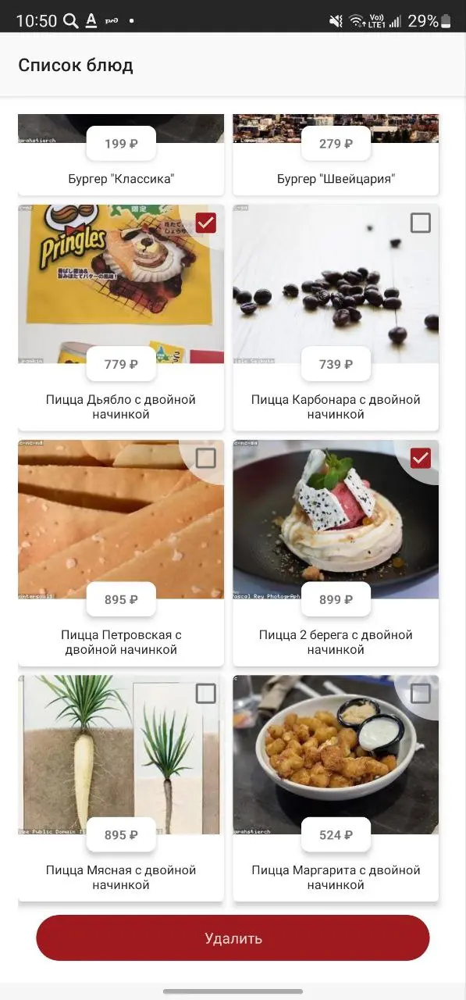
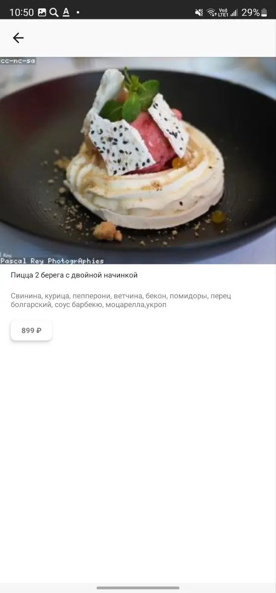

# DishList
Простое Single Activity приложение с двумя фрагментами.
Первый экран отображает вертикальный список блюд (RecyclerView) с чекбоксами.
В слое представления использован MVVM подход.
Список блюд получается из mock списка: https://gist.github.com/ilyamv/acc524a2e49c8d7759f3a6869cdd0e88

Второй фрагмент открывается при тапе на блюдо из списка и отображает детали блюда.

 

## Architecture
- Clean Architecture
- Views
- MVVM
- Flows

## Stack
- Kotlin
- Coroutines
- Architecture Components
    * Navigation Component
    * ViewModel
- Hilt (Dependency Injection)
